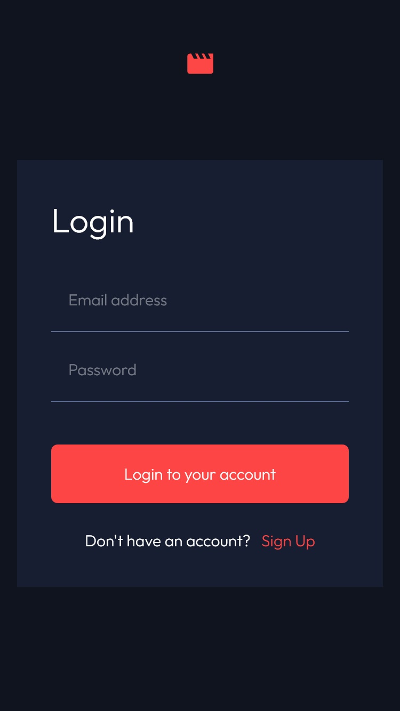

# Frontend Mentor - Entertainment web app

This is a solution to the [Entertainment web app challenge on Frontend Mentor](https://www.frontendmentor.io/challenges/entertainment-web-app-J-UhgAW1X). I used this challenge as a mockup and implemented few own ideas.

## Table of contents

- [Overview](#overview)
  - [Project description](#description)
  - [How to use](#how-to-use)
  - [Screenshot](#screenshot)
  - [Technology stack](#technology-stack)
  - [Further improvements](#further-improvements)
- [Author](#author)

## Overview

### Description

Entertainment web app is a web application that allows users to create accounts and log in to their existing accounts. The main functionality of the application is browsing movies and TV shows, as well as adding them to bookmarks, which allows users to easily find their favorite productions in the future.

The project was implemented using frontend technologies such as React, TypeScript, Tailwind, and Next.js. Movies are fetched from a data.json file, while user accounts are stored in a MongoDB database. The application also features notifications and error handling, which were implemented to improve user experience and ease of use.

Additionally, the application allows users to change their passwords and logout. The playback functionality is not available.

[Link to the application](https://frontend-mentor-entertainment-web-app.vercel.app/)

### How to use

Create an account by providing an email and password (please use fictitious names, do not provide your real email or password). Log in with the created credentials.

You can browse movies by using the search bar or by browsing individual productions on their respective pages. The bookmark function is available under the visible flag icon for each movie.

In the user panel, you can log out or change your password.

### Screenshot

### Technology stack

- React
- TypeScript
- Next.js
- Tailwind
- MongoDB
- React-slick

### Further improvements

The application needs to add at least unit tests and the duration of video downloading and converting is too long, especially in the bookmarks section.

### Author

- Frontend Mentor - [@Pawel-Gnat](https://www.frontendmentor.io/profile/Pawel-Gnat)
- Instagram - [@pawel.coder](https://www.instagram.com/pawel.coder/)
